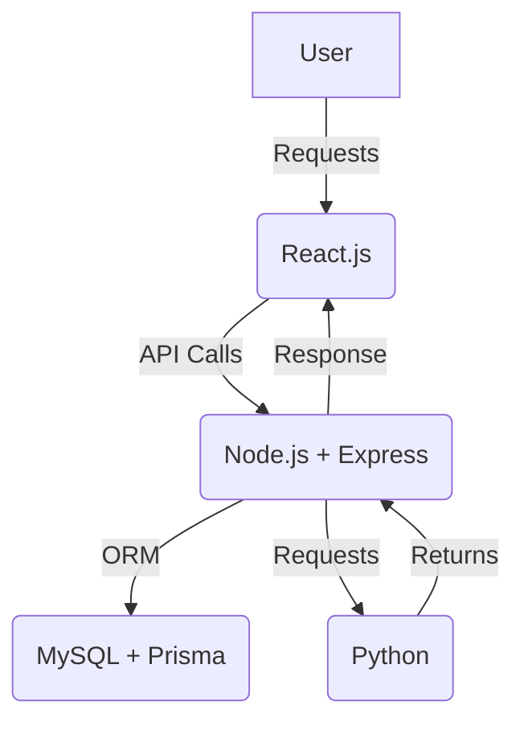

# **AI-Powered Personalized Learning Path Recommendation System**  

An intelligent learning recommendation system that provides customized learning paths based on users' skills, goals, and engagement.  

## **📌 Features**  
- ✅ Personalized course recommendations based on user skills and career goals  
- ✅ AI-driven skill assessment and improvement suggestions  
- ✅ Real-time data analytics for user learning patterns  
- ✅ Scalable architecture with Node.js, React, Prisma, and MySQL  

---

## **💂 Tech Stack**  

| Technology    | Purpose |
|--------------|---------|
| **Frontend**  | React.js, TailwindCSS |
| **Backend**   | Node.js, Express.js, Prisma, MySQL |
| **AI Engine** | Python, Scikit-learn, Pandas,Random forest |
| **Deployment** | Hostinger, Vercel |

---

## **🚀 Setup Instructions**  

### **1️⃣ Clone the Repository**  
```bash
git clone https://github.com/rajnishkumar13500/amdocs.git
cd amdocs
```

### **2️⃣ Backend Setup (Node.js & Prisma with MySQL)**  
```bash
cd BENODE
npm install
```
- Create a `.env` file and configure the database connection  
- Run database migrations  
```bash
npx prisma generate 
npx prisma migrate dev
```
- Start the backend server  
```bash
npm run start
```

### **3️⃣ Frontend Setup (React.js)**  
```bash
cd ../FE
npm install
npm run dev
```

### **4️⃣ AI Recommendation Engine Setup (Python)**  
```bash
cd ../BE
python -m venv venv
source venv/bin/activate  # macOS/Linux
venv\Scripts\activate  # Windows
pip install -r requirements.txt
python app.py
```

---

## **📊 System Architecture**  



---

## **📈 Future Scope**  
- 🔹 **Business Relevance:** Helps learners get personalized upskilling paths  
- 🔹 **Optimization:** Improve recommendation accuracy with deep learning  
- 🔹 **Scalability:** Extend for multiple industries like job matchmaking
- 🔹 **Data Feeding:** Using the Platform data for further model training/enhancement

---


## **💌 Contact**  
For any queries, reach out at:  
💎 **Email:** [rajnishkumar13500@gmail.com]  
🌐 **LinkedIn:** [https://www.linkedin.com/in/rajnish-kumar-412aba106/]  

Happy coding! 

